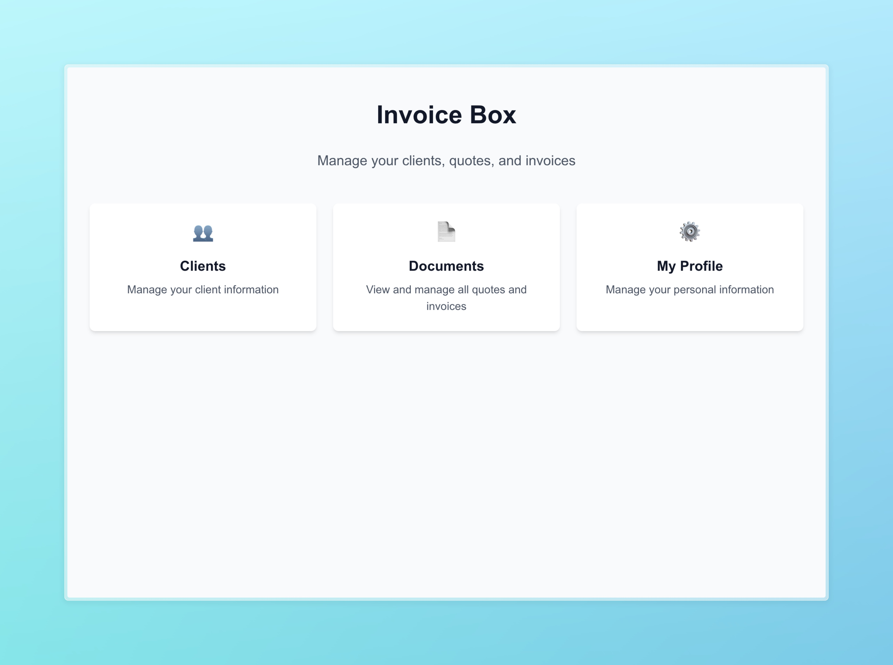
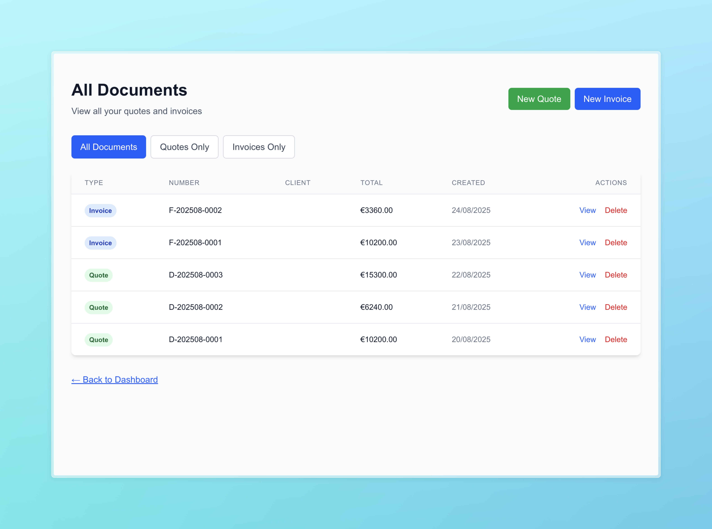
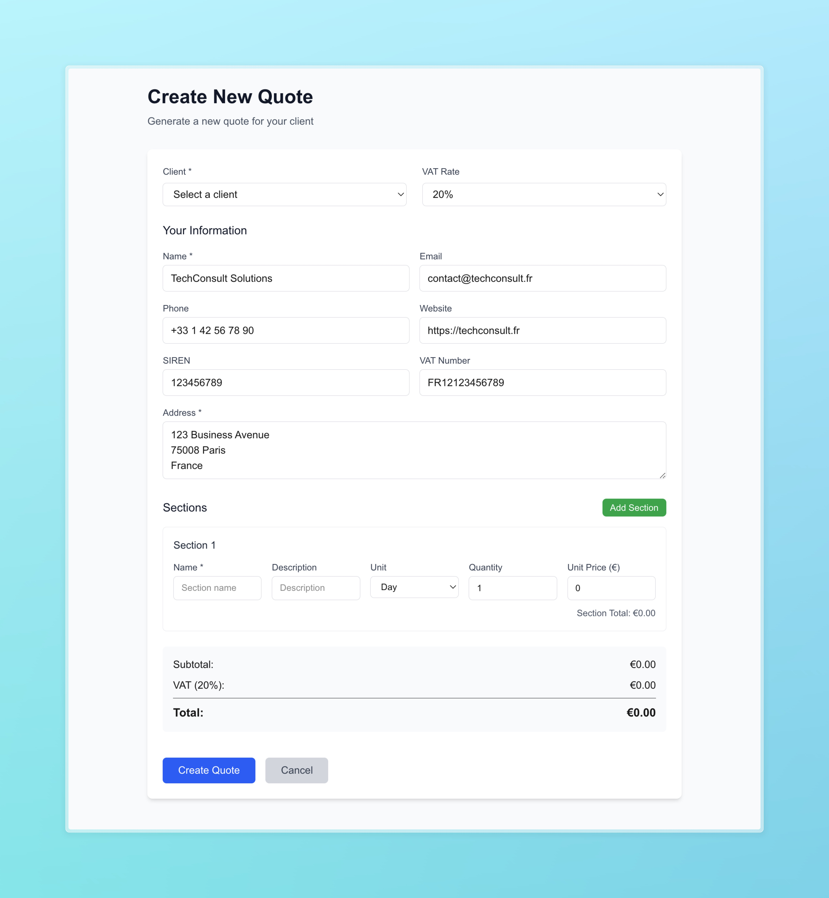
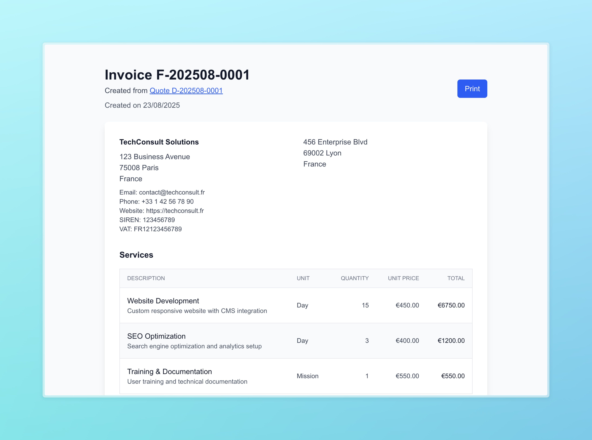

# InvoiceBox

> **⚠️ DISCLAIMER**: This project was rapidly prototyped and "vibe coded" in just a few hours. While functional, it may contain critical flaws, security vulnerabilities, or architectural issues. Use at your own risk and thoroughly review/test before any production use.

A modern, professional invoice and quote management system built with Next.js and SQLite. Create, manage, and convert quotes to invoices with ease.

## ✨ Features

- **📋 Client Management**: Add, edit, and organize client information with support for SIREN and VAT numbers
- **📄 Quote Creation**: Generate professional quotes with custom sections, pricing, and VAT calculations
- **🧾 Invoice Generation**: Convert quotes to invoices seamlessly or create standalone invoices
- **🔗 Document Linking**: Automatic linking between quotes and their derived invoices
- **🎨 Professional Design**: Clean, print-optimized layouts that fit perfectly on A4 pages
- **📱 Responsive Interface**: Works seamlessly across desktop, tablet, and mobile devices
- **💾 Local Database**: SQLite-based storage with automatic schema migrations
- **🖨️ Print-Ready**: Optimized layouts for professional document printing

## 🚀 Getting Started

### Prerequisites

- Node.js 18+
- npm, yarn, pnpm, or bun

### Installation

1. Clone the repository:

```bash
git clone <repository-url>
cd invoicebox
```

2. Install dependencies:

```bash
npm install
```

3. Start the development server:

```bash
npm run dev
```

4. Open [http://localhost:3000](http://localhost:3000) in your browser

## 📸 Screenshots

### Dashboard

The main dashboard provides quick access to all core features with an intuitive card-based interface.



### Document Management

View and manage all your quotes and invoices in one centralized location.



### Quote Creation

Create professional quotes with detailed sections, custom pricing, and automatic calculations.



### Professional Document View

Clean, professional document layouts optimized for both screen viewing and printing.



## 🏗️ Architecture

### Technology Stack

- **Frontend**: Next.js 15 with App Router
- **Database**: SQLite with promisified operations
- **Styling**: Tailwind CSS
- **Language**: TypeScript
- **Architecture**: Service layer pattern with RESTful APIs

### Project Structure

```
src/
├── app/                    # Next.js App Router pages
│   ├── api/               # API endpoints
│   ├── clients/           # Client management pages
│   ├── documents/         # Document viewing and creation
│   └── profile/           # User profile management
├── lib/
│   ├── database.ts        # Database configuration and schema
│   └── services/          # Business logic services
└── types/                 # TypeScript type definitions
```

### Database Schema

- **clients**: Client information and addresses
- **documents**: Unified table for quotes and invoices
- **document_sections**: Line items with flexible units (day/hour/mission)
- **document_counters**: Auto-incrementing document numbering
- **user_profile**: Personal/business information

## 📋 Features in Detail

### Document Numbering System

- **Quotes**: `D-YYYYMM-XXXX` format (D for "Devis")
- **Invoices**: `F-YYYYMM-XXXX` format (F for "Facture")
- Automatic monthly sequence numbering

### Quote to Invoice Workflow

1. Create a quote for your client
2. Send quote for approval
3. Convert approved quote to invoice with one click
4. Automatic linking and reference tracking
5. Professional invoice generation with quote reference

### Professional Printing

- A4-optimized layouts
- Print-specific styling with `print:` Tailwind classes
- Automatic footer positioning
- Clean, professional appearance

## 🛠️ Development

### Available Scripts

```bash
npm run dev          # Start development server
npm run build        # Build for production
npm run start        # Start production server
npm run lint         # Run ESLint
```

### Database Migrations

The application automatically handles database schema migrations on startup. New columns and tables are added safely without data loss.

### Adding New Features

The project follows a clean architecture pattern:

1. **Types**: Define interfaces in `src/types/index.ts`
2. **Database**: Add schema changes to `src/lib/database.ts`
3. **Services**: Implement business logic in `src/lib/services/`
4. **API**: Create endpoints in `src/app/api/`
5. **UI**: Build pages in `src/app/`

## 🔧 Configuration

### User Profile

Configure your business information in the profile section:

- Business name and address
- Contact information (email, phone, website)
- Tax information (SIREN, VAT number)
- Banking details (bank, IBAN, BIC)
- Terms and conditions

### Document Templates

Documents automatically include:

- Your business information
- Client details
- Service sections with flexible pricing
- VAT calculations
- Professional formatting

## 📝 License

This project is licensed under the MIT License - see the [LICENSE](LICENSE) file for details.

## 🤝 Contributing

This project isn't intended for ongoing maintenance, but you're welcome to fork and adapt it however you like.

## 📞 Support

Sorry, no support available for this rapid prototype!
